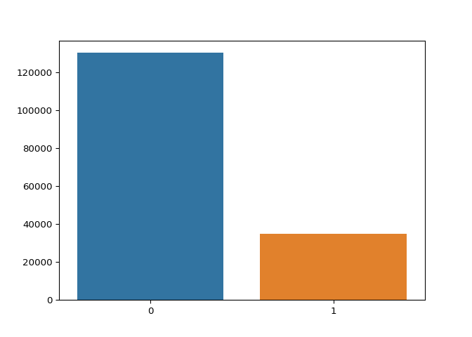
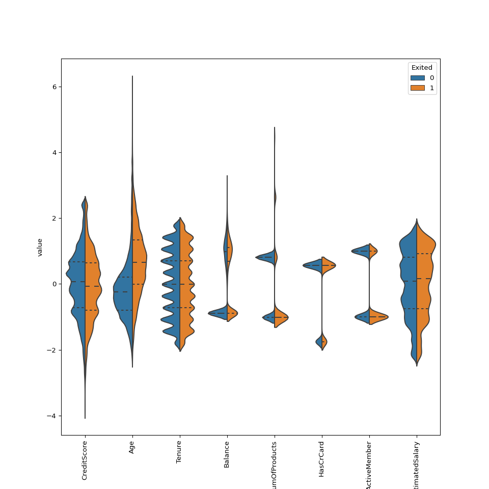
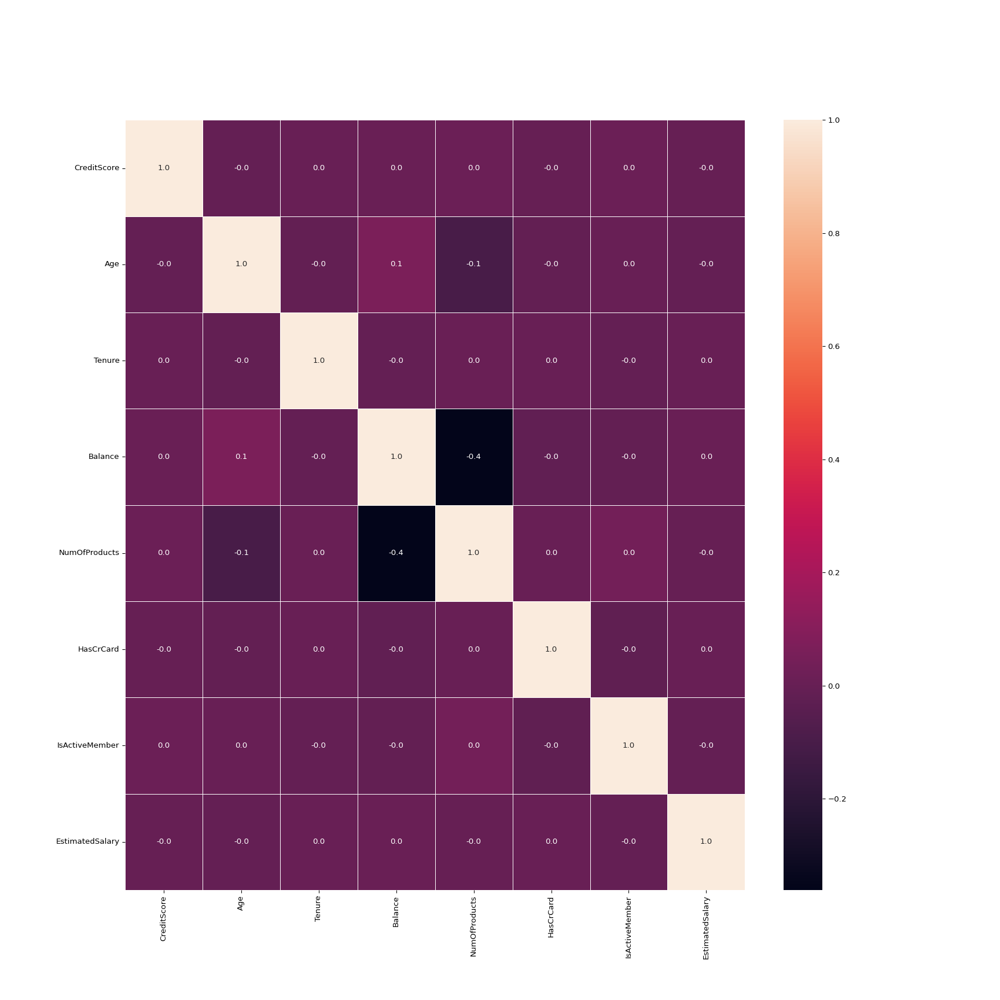

```r
library(reticulate)
library(tidyverse)
library(kableExtra)


# tabulate python tables
pytable <- function(object, row = 0){
  if(row == 0){
    py[object] %>% kbl() %>%
  kable_material_dark()
  } else {
    py[object] %>% head(row) %>% kbl() %>%
  kable_material_dark()
  }}
```

# Set up

```python
import matplotlib as mpl
import matplotlib.pyplot as plt
import pandas as pd
import numpy as np
import seaborn as sns
import zipfile 
from zipfile import ZipFile 


# opening the zip file in READ mode 
file_name = "playground-series-s4e1.zip"
with ZipFile(file_name, 'r') as zip: 
    # printing all the contents of the zip file 
    zip.printdir()
    
    
# import
```

```
## File Name                                             Modified             Size
## sample_submission.csv                          2023-12-31 21:34:52      1210263
## test.csv                                       2023-12-31 21:34:52      8086863
## train.csv                                      2023-12-31 21:34:52     12350130
```

```python
df_zip = zipfile.ZipFile(file_name)
train = pd.read_csv(df_zip.open('train.csv'))
test = pd.read_csv(df_zip.open('test.csv'))
sample_submission = pd.read_csv(df_zip.open('sample_submission.csv')) 
```


# EDA

```r
train = py$train
train %>% glimpse()
```

```
## Rows: 165,034
## Columns: 14
## $ id              <dbl> 0, 1, 2, 3, 4, 5, 6, 7, 8, 9, 10, 11, 12, 13, 14, 15, …
## $ CustomerId      <dbl> 15674932, 15749177, 15694510, 15741417, 15766172, 1577…
## $ Surname         <chr> "Okwudilichukwu", "Okwudiliolisa", "Hsueh", "Kao", "Ch…
## $ CreditScore     <dbl> 668, 627, 678, 581, 716, 588, 593, 678, 676, 583, 599,…
## $ Geography       <chr> "France", "France", "France", "France", "Spain", "Germ…
## $ Gender          <chr> "Male", "Male", "Male", "Male", "Male", "Male", "Femal…
## $ Age             <dbl> 33, 33, 40, 34, 33, 36, 30, 37, 43, 40, 27, 40, 71, 47…
## $ Tenure          <dbl> 3, 1, 10, 2, 5, 4, 8, 1, 4, 4, 6, 3, 9, 5, 7, 5, 7, 4,…
## $ Balance         <dbl> 0.00, 0.00, 0.00, 148882.54, 0.00, 131778.58, 144772.6…
## $ NumOfProducts   <dbl> 2, 2, 2, 1, 2, 1, 1, 1, 2, 1, 2, 1, 1, 1, 1, 2, 2, 2, …
## $ HasCrCard       <dbl> 1, 1, 1, 1, 1, 1, 1, 1, 1, 1, 1, 1, 1, 1, 1, 1, 0, 1, …
## $ IsActiveMember  <dbl> 0, 1, 0, 1, 1, 0, 0, 0, 0, 1, 0, 0, 1, 1, 1, 0, 1, 0, …
## $ EstimatedSalary <dbl> 181449.97, 49503.50, 184866.69, 84560.88, 15068.83, 13…
## $ Exited          <dbl> 0, 0, 0, 0, 0, 1, 0, 0, 0, 0, 0, 0, 0, 0, 0, 0, 0, 0, …
```

Column names

```r
train %>% colnames()
```

```
##  [1] "id"              "CustomerId"      "Surname"         "CreditScore"    
##  [5] "Geography"       "Gender"          "Age"             "Tenure"         
##  [9] "Balance"         "NumOfProducts"   "HasCrCard"       "IsActiveMember" 
## [13] "EstimatedSalary" "Exited"
```

Summary statistics

```r
library(psych)
train %>% describe()
```

```
##                 vars      n        mean       sd     median     trimmed
## id                 1 165034    82516.50 47641.36    82516.5    82516.50
## CustomerId         2 165034 15692005.02 71397.82 15690169.0 15692350.71
## Surname*           3 165034     1548.28   772.75     1590.0     1562.88
## CreditScore        4 165034      656.45    80.10      659.0      656.82
## Geography*         5 165034        1.65     0.82        1.0        1.56
## Gender*            6 165034        1.56     0.50        2.0        1.58
## Age                7 165034       38.13     8.87       37.0       37.35
## Tenure             8 165034        5.02     2.81        5.0        5.02
## Balance            9 165034    55478.09 62817.66        0.0    50024.77
## NumOfProducts     10 165034        1.55     0.55        2.0        1.54
## HasCrCard         11 165034        0.75     0.43        1.0        0.82
## IsActiveMember    12 165034        0.50     0.50        0.0        0.50
## EstimatedSalary   13 165034   112574.82 50292.87   117948.0   114961.44
## Exited            14 165034        0.21     0.41        0.0        0.14
##                      mad         min        max    range  skew kurtosis     se
## id              61169.85        0.00   165033.0 165033.0  0.00    -1.20 117.27
## CustomerId      92277.02 15565701.00 15815690.0 249989.0 -0.02    -1.21 175.75
## Surname*          965.17        1.00     2797.0   2796.0 -0.15    -1.13   1.90
## CreditScore        81.54      350.00      850.0    500.0 -0.06    -0.07   0.20
## Geography*          0.00        1.00        3.0      2.0  0.73    -1.12   0.00
## Gender*             0.00        1.00        2.0      1.0 -0.26    -1.93   0.00
## Age                 7.41       18.00       92.0     74.0  0.97     1.53   0.02
## Tenure              2.97        0.00       10.0     10.0  0.01    -1.16   0.01
## Balance             0.00        0.00   250898.1 250898.1  0.38    -1.60 154.63
## NumOfProducts       0.00        1.00        4.0      3.0  0.37    -0.28   0.00
## HasCrCard           0.00        0.00        1.0      1.0 -1.18    -0.61   0.00
## IsActiveMember      0.00        0.00        1.0      1.0  0.01    -2.00   0.00
## EstimatedSalary 59468.62       11.58   199992.5 199980.9 -0.31    -0.84 123.80
## Exited              0.00        0.00        1.0      1.0  1.41    -0.01   0.00
```


## CustomerId

Examining rows per CustomerId to check data row independence.

```r
(entries_per_customer <- train %>% group_by(CustomerId) %>% tally())
```

```
## # A tibble: 23,221 × 2
##    CustomerId     n
##         <dbl> <int>
##  1   15565701     3
##  2   15565706     4
##  3   15565714     3
##  4   15565759     1
##  5   15565779     5
##  6   15565796     8
##  7   15565806     6
##  8   15565807     1
##  9   15565878    12
## 10   15565879     5
## # ℹ 23,211 more rows
```


```r
(entries_per_customer %>% group_by(n) %>% tally())
```

```
## # A tibble: 88 × 2
##        n    nn
##    <int> <int>
##  1     1  9301
##  2     2  2945
##  3     3  1373
##  4     4   929
##  5     5   702
##  6     6   622
##  7     7   492
##  8     8   483
##  9     9   444
## 10    10   435
## # ℹ 78 more rows
```

```r
n_4 <- entries_per_customer %>% filter(n == 4)
train %>% filter(CustomerId %in% n_4$CustomerId) %>% arrange(CustomerId) %>% head()
```

```
##       id CustomerId  Surname CreditScore Geography Gender Age Tenure  Balance
## 1   8288   15565706 Akobundu         663     Spain   Male  35      4      0.0
## 2  93734   15565706 McGregor         564    France   Male  34      8      0.0
## 3 106193   15565706 Akobundu         682    France   Male  37      1      0.0
## 4 118192   15565706    Chung         699   Germany   Male  39      5 124576.6
## 5   8753   15566091 Thurgood         527    France   Male  32      1      0.0
## 6  19945   15566091  Thomsen         683     Spain Female  32      4      0.0
##   NumOfProducts HasCrCard IsActiveMember EstimatedSalary Exited
## 1             1         1              1        83256.26      1
## 2             2         0              1        53584.03      0
## 3             1         1              1        83256.26      0
## 4             2         1              0       160593.41      0
## 5             2         1              0        94739.20      0
## 6             1         1              0        94739.20      0
```

Based on this cursory exploration of CustomerId, it's safe to say this feature doesn't make much sense. As it turns out, this is a synthetic dataset so it's not surprising CustomerId, and likely id and Surname, are probably nonsense. We examined this because we're afraid of non-independence of data instances but it looks like we'll ignore this problem in synthetic datasets. 

## Train info

```python
train.info()
```

```
## <class 'pandas.core.frame.DataFrame'>
## RangeIndex: 165034 entries, 0 to 165033
## Data columns (total 14 columns):
##  #   Column           Non-Null Count   Dtype  
## ---  ------           --------------   -----  
##  0   id               165034 non-null  int64  
##  1   CustomerId       165034 non-null  int64  
##  2   Surname          165034 non-null  object 
##  3   CreditScore      165034 non-null  int64  
##  4   Geography        165034 non-null  object 
##  5   Gender           165034 non-null  object 
##  6   Age              165034 non-null  float64
##  7   Tenure           165034 non-null  int64  
##  8   Balance          165034 non-null  float64
##  9   NumOfProducts    165034 non-null  int64  
##  10  HasCrCard        165034 non-null  float64
##  11  IsActiveMember   165034 non-null  float64
##  12  EstimatedSalary  165034 non-null  float64
##  13  Exited           165034 non-null  int64  
## dtypes: float64(5), int64(6), object(3)
## memory usage: 17.6+ MB
```

## x, y split


```python
from sklearn.model_selection import train_test_split
# drop id columns
train.drop(["id","CustomerId","Surname"],axis = 1, inplace = True)
# features
x_train = train.drop(["Exited"], axis = 1)
# label
y_train = train.Exited

X_data, X_valid, y_data,y_valid =  train_test_split(x_train, y_train, test_size=0.33,  random_state=42, stratify = y_train)
```

## y - Exited


```python
y_train.value_counts()
```

```
## 0    130113
## 1     34921
## Name: Exited, dtype: int64
```

```python
fig_exit = sns.barplot(x = y_train.value_counts().index, y = y_train.value_counts().values)
plt.show()
```



### violin 

```python
data_dia = y_train
data_num = x_train.select_dtypes(include = "number")
data_n_2 = (data_num - data_num.mean()) / (data_num.std())              # standardization
data = pd.concat([y_train,data_n_2.iloc[:,0:10]],axis=1)
data = pd.melt(data,id_vars="Exited",
                    var_name="features",
                    value_name='value')
plt.figure(figsize=(10,10))
sns.violinplot(x="features", y="value", hue="Exited", data=data,split=True, inner="quart")
plt.xticks(rotation=90)
```

```
## (array([0, 1, 2, 3, 4, 5, 6, 7]), [Text(0, 0, 'CreditScore'), Text(1, 0, 'Age'), Text(2, 0, 'Tenure'), Text(3, 0, 'Balance'), Text(4, 0, 'NumOfProducts'), Text(5, 0, 'HasCrCard'), Text(6, 0, 'IsActiveMember'), Text(7, 0, 'EstimatedSalary')])
```

```python
plt.show()
```



### heat map


```python
#correlation map
f,ax = plt.subplots(figsize=(18, 18))
sns.heatmap(data_num.corr(), annot=True, linewidths=.5, fmt= '.1f',ax=ax)
# This sets the yticks "upright" with 0, as opposed to sideways with 90.
plt.yticks(rotation=0) 
```

```
## (array([0.5, 1.5, 2.5, 3.5, 4.5, 5.5, 6.5, 7.5]), [Text(0, 0.5, 'CreditScore'), Text(0, 1.5, 'Age'), Text(0, 2.5, 'Tenure'), Text(0, 3.5, 'Balance'), Text(0, 4.5, 'NumOfProducts'), Text(0, 5.5, 'HasCrCard'), Text(0, 6.5, 'IsActiveMember'), Text(0, 7.5, 'EstimatedSalary')])
```

```python
plt.xticks(rotation=90)
```

```
## (array([0.5, 1.5, 2.5, 3.5, 4.5, 5.5, 6.5, 7.5]), [Text(0.5, 0, 'CreditScore'), Text(1.5, 0, 'Age'), Text(2.5, 0, 'Tenure'), Text(3.5, 0, 'Balance'), Text(4.5, 0, 'NumOfProducts'), Text(5.5, 0, 'HasCrCard'), Text(6.5, 0, 'IsActiveMember'), Text(7.5, 0, 'EstimatedSalary')])
```

```python
plt.show()
```



# Preprocess pipeline

```python
from sklearn.pipeline import Pipeline
from sklearn.compose import ColumnTransformer, make_column_selector
from sklearn.preprocessing import OneHotEncoder
from sklearn.preprocessing import StandardScaler
from sklearn.preprocessing import FunctionTransformer
from sklearn.impute import SimpleImputer

cat_col = x_train.select_dtypes("object").columns
num_col = x_train.select_dtypes("number").columns

# numerical transformer
num_pipe = Pipeline(steps=[
    ("standardize", StandardScaler())
])
# categorical transformer
cat_pipe = Pipeline(steps=[
    ("ohe", OneHotEncoder(handle_unknown="ignore"))
])

preprocess = ColumnTransformer(
    transformers=[
        ("numerical", num_pipe, num_col),
        ("categorical", cat_pipe, cat_col),
    ],
    remainder = "passthrough"
)
```

# Model fit and evaluation

## Models

```python
import xgboost
import lightgbm
from sklearn.ensemble import RandomForestClassifier
from sklearn.linear_model import LogisticRegression
from xgboost import XGBClassifier
from lightgbm import LGBMClassifier

lor = LogisticRegression()
xgb = XGBClassifier()
rf = RandomForestClassifier()
lgbm = LGBMClassifier()

clfs = {
     'lor':lor,
     'rf':rf,
     'xgb':xgb,
     'lgbm':lgbm
     
}
```

## train function


```python
from sklearn.metrics import precision_score,accuracy_score,recall_score,f1_score

def Train_Model(clf,x_train,y_train,x_test,y_test):
     
     pipeline = Pipeline(steps=[
          ('column_tran',preprocess),
          ('model',clf)
     ])

     pipeline.fit(x_train,y_train)
     y_pred = pipeline.predict(x_test)
     acc = accuracy_score(y_test,y_pred)
     ps = precision_score(y_test,y_pred)
     rec = recall_score(y_test,y_pred)
     f1 = f1_score(y_test,y_pred)
     return acc , ps ,rec, f1
```

## Fit


```python
acc_score = []
pre_score = []
recall = []
f1s = []

for key,value in clfs.items():
     acc , ps,rs,f1 = Train_Model(value,X_data,y_data,X_valid,y_valid)

     print("name:",key)
     print('ac:',acc)
     print('ps :',ps)
     print('rs:',rs)
     print('f1:',f1)
     
     acc_score.append(acc)
     pre_score.append(ps)
     recall.append(rs)
     f1s.append(f1)
```

```
## name: lor
## ac: 0.8332598876280709
## ps : 0.6945373467112598
## rs: 0.37842762929538354
## f1: 0.4899174296466887
## name: rf
## ac: 0.8574418860857111
## ps : 0.7214369846878681
## rs: 0.5314994793474488
## f1: 0.6120715499150594
## name: xgb
## ac: 0.8636847710330139
## ps : 0.7366112650046168
## rs: 0.5538007636237418
## f1: 0.6322567862096294
## [LightGBM] [Info] Number of positive: 23397, number of negative: 87175
## [LightGBM] [Info] Auto-choosing row-wise multi-threading, the overhead of testing was 0.000839 seconds.
## You can set `force_row_wise=true` to remove the overhead.
## And if memory is not enough, you can set `force_col_wise=true`.
## [LightGBM] [Info] Total Bins 865
## [LightGBM] [Info] Number of data points in the train set: 110572, number of used features: 13
## [LightGBM] [Info] [binary:BoostFromScore]: pavg=0.211600 -> initscore=-1.315310
## [LightGBM] [Info] Start training from score -1.315310
## name: lgbm
## ac: 0.8649700708751056
## ps : 0.7446034725480994
## rs: 0.5507636237417564
## f1: 0.6331803671189147
```

## Compare metrics


```python
model_df = pd.DataFrame({'Algoritham':clfs.keys(),'Accuracy Score':acc_score,'Precision Score':pre_score,'Recall Score':recall,'F1 Score':f1s}).sort_values('Accuracy Score',ascending=False)
```

```r
"model_df" %>% pytable()
```

<table class=" lightable-material-dark" style='font-family: "Source Sans Pro", helvetica, sans-serif; margin-left: auto; margin-right: auto;'>
 <thead>
  <tr>
   <th style="text-align:left;">   </th>
   <th style="text-align:left;"> Algoritham </th>
   <th style="text-align:right;"> Accuracy Score </th>
   <th style="text-align:right;"> Precision Score </th>
   <th style="text-align:right;"> Recall Score </th>
   <th style="text-align:right;"> F1 Score </th>
  </tr>
 </thead>
<tbody>
  <tr>
   <td style="text-align:left;"> 3 </td>
   <td style="text-align:left;"> lgbm </td>
   <td style="text-align:right;"> 0.8649701 </td>
   <td style="text-align:right;"> 0.7446035 </td>
   <td style="text-align:right;"> 0.5507636 </td>
   <td style="text-align:right;"> 0.6331804 </td>
  </tr>
  <tr>
   <td style="text-align:left;"> 2 </td>
   <td style="text-align:left;"> xgb </td>
   <td style="text-align:right;"> 0.8636848 </td>
   <td style="text-align:right;"> 0.7366113 </td>
   <td style="text-align:right;"> 0.5538008 </td>
   <td style="text-align:right;"> 0.6322568 </td>
  </tr>
  <tr>
   <td style="text-align:left;"> 1 </td>
   <td style="text-align:left;"> rf </td>
   <td style="text-align:right;"> 0.8574419 </td>
   <td style="text-align:right;"> 0.7214370 </td>
   <td style="text-align:right;"> 0.5314995 </td>
   <td style="text-align:right;"> 0.6120715 </td>
  </tr>
  <tr>
   <td style="text-align:left;"> 0 </td>
   <td style="text-align:left;"> lor </td>
   <td style="text-align:right;"> 0.8332599 </td>
   <td style="text-align:right;"> 0.6945373 </td>
   <td style="text-align:right;"> 0.3784276 </td>
   <td style="text-align:right;"> 0.4899174 </td>
  </tr>
</tbody>
</table>

## Voting classifier


```python
from sklearn.ensemble import VotingClassifier

vote = VotingClassifier(estimators=[
     ('xgb',xgb),
     ('random forest',rf),
     ('lgbm',lgbm)], voting = 'soft')

vote_pipeline = Pipeline(steps=[
     ('colums_tran',preprocess),
     ('model',vote)
])

vote_pipeline.fit(x_train,y_train)
```

```{=html}
<style>#sk-container-id-1 {color: black;background-color: white;}#sk-container-id-1 pre{padding: 0;}#sk-container-id-1 div.sk-toggleable {background-color: white;}#sk-container-id-1 label.sk-toggleable__label {cursor: pointer;display: block;width: 100%;margin-bottom: 0;padding: 0.3em;box-sizing: border-box;text-align: center;}#sk-container-id-1 label.sk-toggleable__label-arrow:before {content: "▸";float: left;margin-right: 0.25em;color: #696969;}#sk-container-id-1 label.sk-toggleable__label-arrow:hover:before {color: black;}#sk-container-id-1 div.sk-estimator:hover label.sk-toggleable__label-arrow:before {color: black;}#sk-container-id-1 div.sk-toggleable__content {max-height: 0;max-width: 0;overflow: hidden;text-align: left;background-color: #f0f8ff;}#sk-container-id-1 div.sk-toggleable__content pre {margin: 0.2em;color: black;border-radius: 0.25em;background-color: #f0f8ff;}#sk-container-id-1 input.sk-toggleable__control:checked~div.sk-toggleable__content {max-height: 200px;max-width: 100%;overflow: auto;}#sk-container-id-1 input.sk-toggleable__control:checked~label.sk-toggleable__label-arrow:before {content: "▾";}#sk-container-id-1 div.sk-estimator input.sk-toggleable__control:checked~label.sk-toggleable__label {background-color: #d4ebff;}#sk-container-id-1 div.sk-label input.sk-toggleable__control:checked~label.sk-toggleable__label {background-color: #d4ebff;}#sk-container-id-1 input.sk-hidden--visually {border: 0;clip: rect(1px 1px 1px 1px);clip: rect(1px, 1px, 1px, 1px);height: 1px;margin: -1px;overflow: hidden;padding: 0;position: absolute;width: 1px;}#sk-container-id-1 div.sk-estimator {font-family: monospace;background-color: #f0f8ff;border: 1px dotted black;border-radius: 0.25em;box-sizing: border-box;margin-bottom: 0.5em;}#sk-container-id-1 div.sk-estimator:hover {background-color: #d4ebff;}#sk-container-id-1 div.sk-parallel-item::after {content: "";width: 100%;border-bottom: 1px solid gray;flex-grow: 1;}#sk-container-id-1 div.sk-label:hover label.sk-toggleable__label {background-color: #d4ebff;}#sk-container-id-1 div.sk-serial::before {content: "";position: absolute;border-left: 1px solid gray;box-sizing: border-box;top: 0;bottom: 0;left: 50%;z-index: 0;}#sk-container-id-1 div.sk-serial {display: flex;flex-direction: column;align-items: center;background-color: white;padding-right: 0.2em;padding-left: 0.2em;position: relative;}#sk-container-id-1 div.sk-item {position: relative;z-index: 1;}#sk-container-id-1 div.sk-parallel {display: flex;align-items: stretch;justify-content: center;background-color: white;position: relative;}#sk-container-id-1 div.sk-item::before, #sk-container-id-1 div.sk-parallel-item::before {content: "";position: absolute;border-left: 1px solid gray;box-sizing: border-box;top: 0;bottom: 0;left: 50%;z-index: -1;}#sk-container-id-1 div.sk-parallel-item {display: flex;flex-direction: column;z-index: 1;position: relative;background-color: white;}#sk-container-id-1 div.sk-parallel-item:first-child::after {align-self: flex-end;width: 50%;}#sk-container-id-1 div.sk-parallel-item:last-child::after {align-self: flex-start;width: 50%;}#sk-container-id-1 div.sk-parallel-item:only-child::after {width: 0;}#sk-container-id-1 div.sk-dashed-wrapped {border: 1px dashed gray;margin: 0 0.4em 0.5em 0.4em;box-sizing: border-box;padding-bottom: 0.4em;background-color: white;}#sk-container-id-1 div.sk-label label {font-family: monospace;font-weight: bold;display: inline-block;line-height: 1.2em;}#sk-container-id-1 div.sk-label-container {text-align: center;}#sk-container-id-1 div.sk-container {/* jupyter's `normalize.less` sets `[hidden] { display: none; }` but bootstrap.min.css set `[hidden] { display: none !important; }` so we also need the `!important` here to be able to override the default hidden behavior on the sphinx rendered scikit-learn.org. See: https://github.com/scikit-learn/scikit-learn/issues/21755 */display: inline-block !important;position: relative;}#sk-container-id-1 div.sk-text-repr-fallback {display: none;}</style><div id="sk-container-id-1" class="sk-top-container"><div class="sk-text-repr-fallback"><pre>Pipeline(steps=[(&#x27;colums_tran&#x27;,
                 ColumnTransformer(remainder=&#x27;passthrough&#x27;,
                                   transformers=[(&#x27;numerical&#x27;,
                                                  Pipeline(steps=[(&#x27;standardize&#x27;,
                                                                   StandardScaler())]),
                                                  Index([&#x27;CreditScore&#x27;, &#x27;Age&#x27;, &#x27;Tenure&#x27;, &#x27;Balance&#x27;, &#x27;NumOfProducts&#x27;, &#x27;HasCrCard&#x27;,
       &#x27;IsActiveMember&#x27;, &#x27;EstimatedSalary&#x27;],
      dtype=&#x27;object&#x27;)),
                                                 (&#x27;categorical&#x27;,
                                                  Pipeline(steps=[(&#x27;ohe&#x27;,
                                                                   OneHotEncoder(handle_unknown=&#x27;igno...
                                                             max_bin=None,
                                                             max_cat_threshold=None,
                                                             max_cat_to_onehot=None,
                                                             max_delta_step=None,
                                                             max_depth=None,
                                                             max_leaves=None,
                                                             min_child_weight=None,
                                                             missing=nan,
                                                             monotone_constraints=None,
                                                             multi_strategy=None,
                                                             n_estimators=None,
                                                             n_jobs=None,
                                                             num_parallel_tree=None,
                                                             random_state=None, ...)),
                                              (&#x27;random forest&#x27;,
                                               RandomForestClassifier()),
                                              (&#x27;lgbm&#x27;, LGBMClassifier())],
                                  voting=&#x27;soft&#x27;))])</pre><b>In a Jupyter environment, please rerun this cell to show the HTML representation or trust the notebook. <br />On GitHub, the HTML representation is unable to render, please try loading this page with nbviewer.org.</b></div><div class="sk-container" hidden><div class="sk-item sk-dashed-wrapped"><div class="sk-label-container"><div class="sk-label sk-toggleable"><input class="sk-toggleable__control sk-hidden--visually" id="sk-estimator-id-1" type="checkbox" ><label for="sk-estimator-id-1" class="sk-toggleable__label sk-toggleable__label-arrow">Pipeline</label><div class="sk-toggleable__content"><pre>Pipeline(steps=[(&#x27;colums_tran&#x27;,
                 ColumnTransformer(remainder=&#x27;passthrough&#x27;,
                                   transformers=[(&#x27;numerical&#x27;,
                                                  Pipeline(steps=[(&#x27;standardize&#x27;,
                                                                   StandardScaler())]),
                                                  Index([&#x27;CreditScore&#x27;, &#x27;Age&#x27;, &#x27;Tenure&#x27;, &#x27;Balance&#x27;, &#x27;NumOfProducts&#x27;, &#x27;HasCrCard&#x27;,
       &#x27;IsActiveMember&#x27;, &#x27;EstimatedSalary&#x27;],
      dtype=&#x27;object&#x27;)),
                                                 (&#x27;categorical&#x27;,
                                                  Pipeline(steps=[(&#x27;ohe&#x27;,
                                                                   OneHotEncoder(handle_unknown=&#x27;igno...
                                                             max_bin=None,
                                                             max_cat_threshold=None,
                                                             max_cat_to_onehot=None,
                                                             max_delta_step=None,
                                                             max_depth=None,
                                                             max_leaves=None,
                                                             min_child_weight=None,
                                                             missing=nan,
                                                             monotone_constraints=None,
                                                             multi_strategy=None,
                                                             n_estimators=None,
                                                             n_jobs=None,
                                                             num_parallel_tree=None,
                                                             random_state=None, ...)),
                                              (&#x27;random forest&#x27;,
                                               RandomForestClassifier()),
                                              (&#x27;lgbm&#x27;, LGBMClassifier())],
                                  voting=&#x27;soft&#x27;))])</pre></div></div></div><div class="sk-serial"><div class="sk-item sk-dashed-wrapped"><div class="sk-label-container"><div class="sk-label sk-toggleable"><input class="sk-toggleable__control sk-hidden--visually" id="sk-estimator-id-2" type="checkbox" ><label for="sk-estimator-id-2" class="sk-toggleable__label sk-toggleable__label-arrow">colums_tran: ColumnTransformer</label><div class="sk-toggleable__content"><pre>ColumnTransformer(remainder=&#x27;passthrough&#x27;,
                  transformers=[(&#x27;numerical&#x27;,
                                 Pipeline(steps=[(&#x27;standardize&#x27;,
                                                  StandardScaler())]),
                                 Index([&#x27;CreditScore&#x27;, &#x27;Age&#x27;, &#x27;Tenure&#x27;, &#x27;Balance&#x27;, &#x27;NumOfProducts&#x27;, &#x27;HasCrCard&#x27;,
       &#x27;IsActiveMember&#x27;, &#x27;EstimatedSalary&#x27;],
      dtype=&#x27;object&#x27;)),
                                (&#x27;categorical&#x27;,
                                 Pipeline(steps=[(&#x27;ohe&#x27;,
                                                  OneHotEncoder(handle_unknown=&#x27;ignore&#x27;))]),
                                 Index([&#x27;Geography&#x27;, &#x27;Gender&#x27;], dtype=&#x27;object&#x27;))])</pre></div></div></div><div class="sk-parallel"><div class="sk-parallel-item"><div class="sk-item"><div class="sk-label-container"><div class="sk-label sk-toggleable"><input class="sk-toggleable__control sk-hidden--visually" id="sk-estimator-id-3" type="checkbox" ><label for="sk-estimator-id-3" class="sk-toggleable__label sk-toggleable__label-arrow">numerical</label><div class="sk-toggleable__content"><pre>Index([&#x27;CreditScore&#x27;, &#x27;Age&#x27;, &#x27;Tenure&#x27;, &#x27;Balance&#x27;, &#x27;NumOfProducts&#x27;, &#x27;HasCrCard&#x27;,
       &#x27;IsActiveMember&#x27;, &#x27;EstimatedSalary&#x27;],
      dtype=&#x27;object&#x27;)</pre></div></div></div><div class="sk-serial"><div class="sk-item"><div class="sk-serial"><div class="sk-item"><div class="sk-estimator sk-toggleable"><input class="sk-toggleable__control sk-hidden--visually" id="sk-estimator-id-4" type="checkbox" ><label for="sk-estimator-id-4" class="sk-toggleable__label sk-toggleable__label-arrow">StandardScaler</label><div class="sk-toggleable__content"><pre>StandardScaler()</pre></div></div></div></div></div></div></div></div><div class="sk-parallel-item"><div class="sk-item"><div class="sk-label-container"><div class="sk-label sk-toggleable"><input class="sk-toggleable__control sk-hidden--visually" id="sk-estimator-id-5" type="checkbox" ><label for="sk-estimator-id-5" class="sk-toggleable__label sk-toggleable__label-arrow">categorical</label><div class="sk-toggleable__content"><pre>Index([&#x27;Geography&#x27;, &#x27;Gender&#x27;], dtype=&#x27;object&#x27;)</pre></div></div></div><div class="sk-serial"><div class="sk-item"><div class="sk-serial"><div class="sk-item"><div class="sk-estimator sk-toggleable"><input class="sk-toggleable__control sk-hidden--visually" id="sk-estimator-id-6" type="checkbox" ><label for="sk-estimator-id-6" class="sk-toggleable__label sk-toggleable__label-arrow">OneHotEncoder</label><div class="sk-toggleable__content"><pre>OneHotEncoder(handle_unknown=&#x27;ignore&#x27;)</pre></div></div></div></div></div></div></div></div><div class="sk-parallel-item"><div class="sk-item"><div class="sk-label-container"><div class="sk-label sk-toggleable"><input class="sk-toggleable__control sk-hidden--visually" id="sk-estimator-id-7" type="checkbox" ><label for="sk-estimator-id-7" class="sk-toggleable__label sk-toggleable__label-arrow">remainder</label><div class="sk-toggleable__content"><pre>[]</pre></div></div></div><div class="sk-serial"><div class="sk-item"><div class="sk-estimator sk-toggleable"><input class="sk-toggleable__control sk-hidden--visually" id="sk-estimator-id-8" type="checkbox" ><label for="sk-estimator-id-8" class="sk-toggleable__label sk-toggleable__label-arrow">passthrough</label><div class="sk-toggleable__content"><pre>passthrough</pre></div></div></div></div></div></div></div></div><div class="sk-item sk-dashed-wrapped"><div class="sk-label-container"><div class="sk-label sk-toggleable"><input class="sk-toggleable__control sk-hidden--visually" id="sk-estimator-id-9" type="checkbox" ><label for="sk-estimator-id-9" class="sk-toggleable__label sk-toggleable__label-arrow">model: VotingClassifier</label><div class="sk-toggleable__content"><pre>VotingClassifier(estimators=[(&#x27;xgb&#x27;,
                              XGBClassifier(base_score=None, booster=None,
                                            callbacks=None,
                                            colsample_bylevel=None,
                                            colsample_bynode=None,
                                            colsample_bytree=None, device=None,
                                            early_stopping_rounds=None,
                                            enable_categorical=False,
                                            eval_metric=None,
                                            feature_types=None, gamma=None,
                                            grow_policy=None,
                                            importance_type=None,
                                            interaction_constraints=None,
                                            learning_ra...max_bin=None,
                                            max_cat_threshold=None,
                                            max_cat_to_onehot=None,
                                            max_delta_step=None, max_depth=None,
                                            max_leaves=None,
                                            min_child_weight=None, missing=nan,
                                            monotone_constraints=None,
                                            multi_strategy=None,
                                            n_estimators=None, n_jobs=None,
                                            num_parallel_tree=None,
                                            random_state=None, ...)),
                             (&#x27;random forest&#x27;, RandomForestClassifier()),
                             (&#x27;lgbm&#x27;, LGBMClassifier())],
                 voting=&#x27;soft&#x27;)</pre></div></div></div><div class="sk-parallel"><div class="sk-parallel-item"><div class="sk-item"><div class="sk-label-container"><div class="sk-label sk-toggleable"><label>xgb</label></div></div><div class="sk-serial"><div class="sk-item"><div class="sk-estimator sk-toggleable"><input class="sk-toggleable__control sk-hidden--visually" id="sk-estimator-id-10" type="checkbox" ><label for="sk-estimator-id-10" class="sk-toggleable__label sk-toggleable__label-arrow">XGBClassifier</label><div class="sk-toggleable__content"><pre>XGBClassifier(base_score=None, booster=None, callbacks=None,
              colsample_bylevel=None, colsample_bynode=None,
              colsample_bytree=None, device=None, early_stopping_rounds=None,
              enable_categorical=False, eval_metric=None, feature_types=None,
              gamma=None, grow_policy=None, importance_type=None,
              interaction_constraints=None, learning_rate=None, max_bin=None,
              max_cat_threshold=None, max_cat_to_onehot=None,
              max_delta_step=None, max_depth=None, max_leaves=None,
              min_child_weight=None, missing=nan, monotone_constraints=None,
              multi_strategy=None, n_estimators=None, n_jobs=None,
              num_parallel_tree=None, random_state=None, ...)</pre></div></div></div></div></div></div><div class="sk-parallel-item"><div class="sk-item"><div class="sk-label-container"><div class="sk-label sk-toggleable"><label>random forest</label></div></div><div class="sk-serial"><div class="sk-item"><div class="sk-estimator sk-toggleable"><input class="sk-toggleable__control sk-hidden--visually" id="sk-estimator-id-11" type="checkbox" ><label for="sk-estimator-id-11" class="sk-toggleable__label sk-toggleable__label-arrow">RandomForestClassifier</label><div class="sk-toggleable__content"><pre>RandomForestClassifier()</pre></div></div></div></div></div></div><div class="sk-parallel-item"><div class="sk-item"><div class="sk-label-container"><div class="sk-label sk-toggleable"><label>lgbm</label></div></div><div class="sk-serial"><div class="sk-item"><div class="sk-estimator sk-toggleable"><input class="sk-toggleable__control sk-hidden--visually" id="sk-estimator-id-12" type="checkbox" ><label for="sk-estimator-id-12" class="sk-toggleable__label sk-toggleable__label-arrow">LGBMClassifier</label><div class="sk-toggleable__content"><pre>LGBMClassifier()</pre></div></div></div></div></div></div></div></div></div></div></div></div>
```

Save model object

```r
import joblib
joblib.dump(vote_pipeline, 'vote_classifier', compress=9)
```
# Predict - submission

Check labels

```python
# labels
vote_pipeline.classes_
```

```
## array([0, 1])
```

Create and save submission dataframe

```python
# prediction array
y_test = vote_pipeline.predict_proba(test)

# submission df
my_submission = pd.DataFrame({'id': test["id"] , 'Exited': y_test[:,1]})

# save
my_submission.to_csv('submission.csv', index=False)
```


